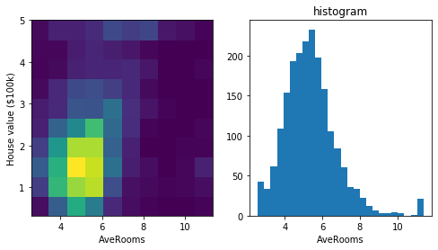

# A Pareto-Efficient Algorithm for Multiple Objective Optimization

Andrew S. Yu

CSDS 440, Fall 2021

Abstract
========

Pareto-efficiency (PE) is a state of a model of a multi-objective optimization (MOO) problem whose parameters cannot be changed without lowering the performance of at least one of the objectives. This study describes an implementation of a generalized algorithm that generates a PE solution to any given MOO problem, with some constraints. This implementation also enables the weighing of objectives in order to produce a variety of different PE solutions to the same problem. The algorithm is applied to an e-commerce setting in which products for sale are placed in an ordered list based on a recommendation system. Two objectives (click-through rate and gross merchandise volume) are used to produce a variety of PE solutions, each of which can be used to generate a new ordered list that is predicted to perform based on the objective weights.

Introduction
============

The concept of Pareto efficiency (PE) was conceived in economics, in which the multiple objectives are represented by the economic incentives of different individuals or groups with common interests. When placed in a novel economic environment, those involved are likely to drive the economic state to a point of PE as long as they participate in and impact the environment \[1\]. This concept is applicable to a wide range of problems and relates to machine learning via multi-objective optimization (MOO). Though it is possible to represent any number of objectives in a single loss function of a machine learning model, there is not a one-to-one relationship between such a solution and one that is PE.

In information retrieval systems, learning to rank (LTR) is a fundamental problem. Many other problems, such as recommendation systems, can be formulated as an LTR problem. Generally speaking, an LTR problem is considered a supervised machine learning problem in which a model is given existing rankings, and then learns to rank an unseen list of items.

There are a variety of ways to approach LTR, as well as a variety of constraints in its application that require different implementations for a model to be successful. The ranking of items in a list is broken down into smaller subproblems because an item and its ranking and relationships to other items can be derived from an ordered list. As such, a model can learn to produce a binary or numerical score for each item. A pairwise score that compares two items can be used to generate a full ranking as well \[2\]. These scoring systems can be used individually or in combination to satisfy different requirements of a specific problem.

When a specific problem is identified and an LTR model is being selected, constraints such as time, volume, and performance requirements should be considered. For example, if the volume is very large and time is limited, then a relatively weak but fast binary ranking model can be used to cull a large portion of the list, after which a stronger but slower model is used to rank the remaining list. This is often the case in e-commerce settings and more generally internet search engines and recommendation systems.

The standard goal in e-commerce settings is gross merchandise volume (GMV), or the total value of products sold. However, it has been noted that prioritizing GMV at all costs is a short-sighted strategy; other objectives such as daily active users and click-through rate (CTR) are indicators of sustained growth \[3, 4\]. Since these objectives are often at odds with each other, using weights in a single loss function to favor one objective may result in heavy losses in another. Instead, it is possible to get the best of both objectives by finding adjustable PE solutions based on the changing needs of the e-commerce business. PE-LTR is a proposed algorithm that generalizes finding PE solutions to LTR problems \[7\], and its authors have applied it to an e-commerce setting in their methodology, using CTR and GMV as described above.

Methods
=======

Pareto Efficient Loss Weighting
-------------------------------

In order to guarantee that a ranking system generates PE solutions, PE-LTR was implemented as described in the manuscript. As described in Algorithm 1 of the source manuscript, the PE-LTR solution involves adding a weight updating step based on the gradients of the multiple losses in the model training procedure after the model parameter updating step in each batch iteration. The new weights are then used in the next model parameter updating step by weighing each loss accordingly. The weights were initialized using 1/K for each of the K losses. Updating the weights based on loss gradient is briefly described in Algorithm 2 of the source manuscript, and details are provided in sections 3.2.2. The actual formula is provided in Theorem 3.3, however, this solution may result in negative weights. Thus, equation 4 is provided to demonstrate how to project the weights to be non-negative as a non-negative least squares problem which can be solved using the active set method.

Model Architecture
------------------

As the innovation of PE-LTR is the "pareto step" in which multiple losses are made pareto-efficient by modification of loss weights, all other aspects of the model architecture are flexible as long as the model and loss formulation have gradients. As such, this study implements a simple dense neural network with a series of linear layers.

Experiments
-----------

First step is the replication of the LTR task in the PE-LTR manuscript, which was distilled down as a click prediction (binary classification) problem. Since the primary contribution of the PE-LTR paper is not in fact specific to LTR, a second regression experiment was also performed to assess the utility of the pareto-efficient weight updating procedure on a diversity of tasks.

### E-Commerce Learning to Rank

Though the authors of PE-LTR released the e-commerce dataset used in the manuscript, it was poorly labeled and not usable. Another dataset with similar characteristics, provided by the Conference on Information and Knowledge Management (CIKM) for its Personalized E-Commerce Search Challenge \[5\], was used instead in this study. This dataset contains more than 90,000 queries on an e-commerce marketplace, each with up to 20 products in its query results. There were more than 100,000 clicks and 1,800 purchases. Of those, 10,000 queries were used to facilitate faster development. Additional information used as features included query duration, product categories, query categories, and product price.

The dataset was split 70/30 into train and test sets. The training data was standardized (zero-mean, unit-variance), and those standardization parameters were also used to standardize the test set data. The model was a single-layer dense neural network of size 64. Batch size was set to accommodate the full dataset such that each epoch consists of a single batch. Training was run for 1000 epochs. For optimization, Adam was used with a learning rate of 0.001. \[6\] The boundary condition for the pareto step was set as 0.2 for both loss weights. The loss functions were modeled after Click through rate (CTR) and gross merchandise volume (GMV). To model the loss function after CTR, each query and its result of up to 20 products were considered on a per-product basis, allowing for the calculation of binary cross entropy on whether each query-product pair was clicked or not. For GMV, the authors of PE-LTR notably claimed that the probability of a product being purchased once clicked was highly correlated with the price of the product and could be approximated without knowing whether the product was actually purchased or not. Thus the GMV loss function can be a product of CTR and the price of the product. Both train and test losses over epochs were plotted, and the weights were plotted against epochs to visualize the weight adjustment dynamics across the training process.

### California Housing Price Prediction

The california housing dataset is a regression dataset for predicting the house value based on 8 covariates. The primary loss was the mean squared error of house value and the secondary loss was L2 regularization loss. The full 20,640 dataset was first randomly subsampled to 2,000 to facilitate rapid development and iteration. For each feature, outliers below the 1st quantile and above the 99th quantile were removed. Training was run for 2000 epochs. A 2D histogram displaying the expected and true housing price for the test data was plotted. All other settings were held the same as in the e-commerce model except for those noted here.

Results
=======

E-Commerce Learning to Rank
---------------------------

3.56% of the query-product pairs were clicked on. Of those, 1.39% were ultimately purchased. Due to potential data leakage and excess data size, many available features were dropped. The top five most common query and product categories as well as unique products were one-hot encoded to provide some additional features without adding too much sparse data. The characteristics table can be found in Table 1.

The model learns quickly in the first 100 epochs of training, but fails to reduce the losses significantly after that. The CTR and GMV validation losses do not decrease past 0.22 and 0.42, respectively. The learning curve of the losses are plotted in Figure 1.

When observing the loss weight dynamics, the CTR loss weight initially starts at the maximum allowed value of 0.8 (since the minimum weight constraint was set to 0.2 and both must sum to 1). However, the weights quickly change with CTR and GMV loss weights settling around 0.6 and 0.4, respectively. The learning curve of the loss weights are plotted in Figure 2.

California Housing
------------------

The median housing price was 1.81 (1.16 - 2.64, $100k). The name and distribution of covariates can be found in Table 2 and Appendix 1.

The training plot shows that both losses continue to decrease, with both losses failing to decrease further after around 500 epochs (Figure 3). Overfitting or compensating (sacrificing one loss for another) behavior is not seen.

Similar to the e-commerce results, the MSE loss weight initially starts at 0.8 then converges around 0.45. The L2 loss converges at 0.55 (Figure 4).

Discussion
==========

The primary objective of this study is successful; it investigates the feasibility of implementing the PE loss-weighting step as a component of a machine learning model, including learning to rank in an e-commerce setting. The constraints on loss weights are respected and are updated accordingly. Since this method guarantees a pareto efficient solution, it is a successful combination of multi-objective optimization and LTR. This study also showcases the generalizability of the algorithm by applying it to a regression problem.

On the other hand, the results of the experiments are not conclusive due to the limitations of this study, thereby failing to evaluate the effectiveness of the PE-LTR algorithm. Firstly, it makes the same assumptions about the e-commerce dataset that are made in the PE-LTR dataset, namely that the probability of purchase can be derived from probability of the product being clicked. Secondly, it does not produce a ranking system from the experimental binary classification model and cannot re-rank or update the given rankings in the query results. This makes it more difficult to analyze from a purely LTR perspective. Finally, it does not compare the performance of the model to other common models used in LTR tasks. The authors of PE-LTR make such comparisons, but do so with other LTR models that only consider one of the two objectives. Ideally, the effect of loss weighting should be accounted for in other LTR models, for example by using loss functions that incorporate both CTR and GMV.

In addition to the shortcomings discussed above, there are other potential improvements that can be made. The generation of a Pareto frontier, a collection of many PE solutions to a single problem, is briefly discussed in the PE-LTR solution. Its implementation could become infeasible if there are more than two objectives to optimize.

* * *

References
==========

1\. Fiorenzo Mornati, « Pareto Optimality in the work of Pareto », Revue européenne des sciences sociales \[En ligne\], 51-2 | 2013, mis en ligne le 01 janvier 2017, consulté le 24 mars 2022. URL : http://journals.openedition.org/ress/2517 ; DOI : https://doi.org/10.4000/ress.2517

2\. Yoav Freund, Raj Iyer, Robert E. Schapire, and Yoram Singer. 2003. An Efficient Boosting Algorithm for Combining Preferences. J. Mach. Learn. Res. 4 (Dec. 2003), 933–969.

3\. Xiao Ma, Liqin Zhao, Guan Huang, Zhi Wang, Zelin Hu, Xiaoqiang Zhu, and Kun Gai. 2018. Entire Space Multi-Task Model: An Effective Approach for Estimating Post-Click Conversion Rate. In The 41st International ACM SIGIR Conference on Research &#38; Development in Information Retrieval (SIGIR ’18). ACM, New York, NY, USA, 1137–1140.

4\. Filip Radlinski, Andrei Broder, Peter Ciccolo, Evgeniy Gabrilovich, Vanja Josifovski, and Lance Riedel. 2008. Optimizing Relevance and Revenue in Ad Search: A Query Substitution Approach. In Proceedings of the 31st Annual International ACM SIGIR Conference on Research and Development in Information Retrieval (SIGIR ’08). ACM, New York, NY, USA, 403–410.

5\. CIKM Cup 2016 Track 2: Personalized E-Commerce Search Challenge, https://competitions.codalab.org/competitions/11161.

6\. Kingma, Diederik P., and Jimmy Ba. "Adam: A method for stochastic optimization." arXiv preprint arXiv:1412.6980 (2014).

7\. Lin, X., Chen, H., Pei, C., Sun, F., Xiao, X., Sun, H., Zhang, Y., Ou, W., and Jiang, P. (2019b). A pareto-efficient algorithm for multiple objective optimization in e-commerce recommendation. In Proceedings of the 13th ACM Conference on Recommender Systems, RecSys ’19, pages 20–28.

* * *

Tables
======

Table 1.

Table of characteristics for the E-Commerce Data. Note the categorical features were used but omitted here.

Table 2.

California Housing Dataset Characterization. Distribution represented as median (IQR). MedHouseVal is the target or the predicted quantity.

Figures
=======

Figure 1.

Training and Validation losses of CTR and GMV over epochs in the E-Commerce model

Figure 2.

CTR and GMV loss weights over epochs in the E-Commerce model

Figure 3.

Training and Validation losses of MSE and L2 in the California Housing model

Figure 4.

CTR and GMV loss weights over epochs in the California Housing model

Appendix 1
==========

For each of the 8 covariates, two figures were generated: the 2d histogram plot with the outcome value